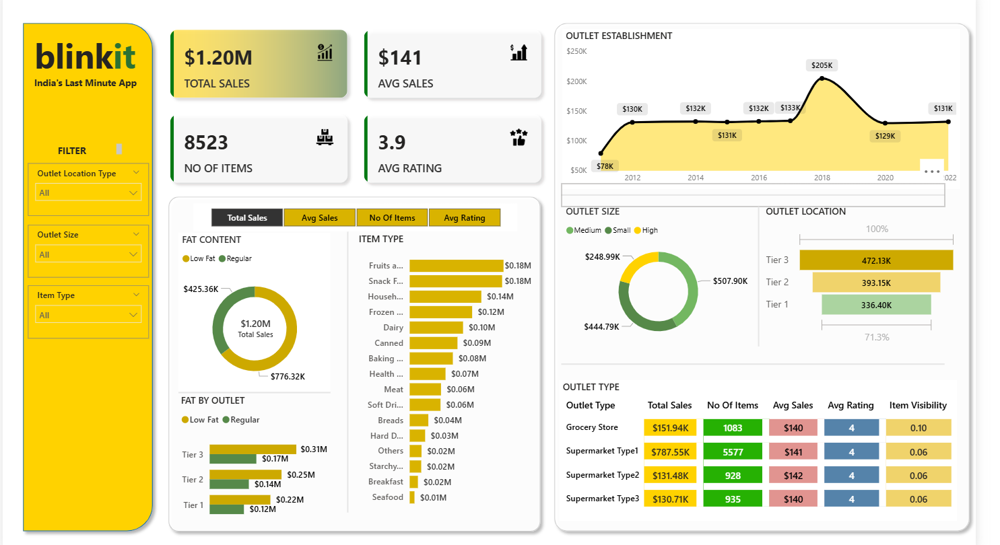

# Blinkit Data Analysis – Capstone Project

This is a capstone data analytics project focused on Blinkit's dataset. It demonstrates data extraction, cleaning, analysis, visualization, and insight generation using **SQL**, **Excel**, **Power BI**, and **Python**.

## 🔧 Tools & Technologies
- SQL (SSMS)
- Microsoft Excel
- Python (Pandas, Matplotlib, Seaborn)
- Power BI

## 📁 Project Components
- SQL: Data extraction and aggregation
- Excel: Cleaning, basic analysis, and pivot charts
- Power BI: Interactive dashboards
- Python: Exploratory Data Analysis (EDA)

## 📊 Key Insights
- Top-selling product categories
- Customer order patterns by time and region
- Revenue contribution by product type
- Seasonal trends in order volume

## 🧠 Skills Demonstrated
- Data cleaning and transformation
- SQL query writing and Joins
- Building BI dashboards
- Data storytelling
- Visual analytics using Power BI
- Python scripting for EDA

## 📸 Screenshots

## 🧾 License
This project is for learning and portfolio purposes only.
